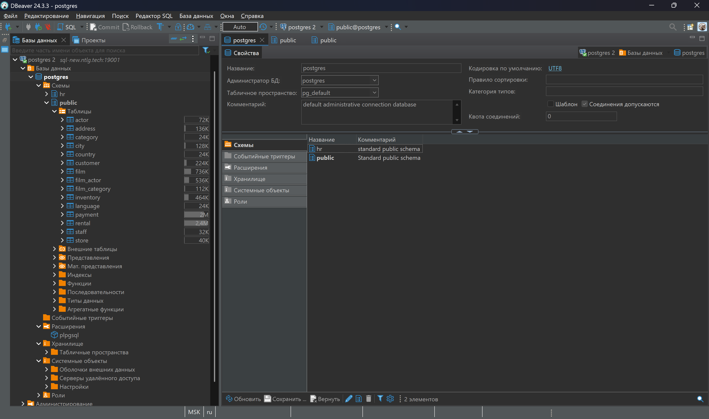
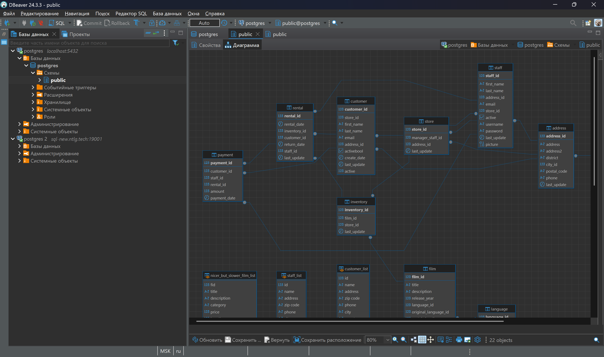
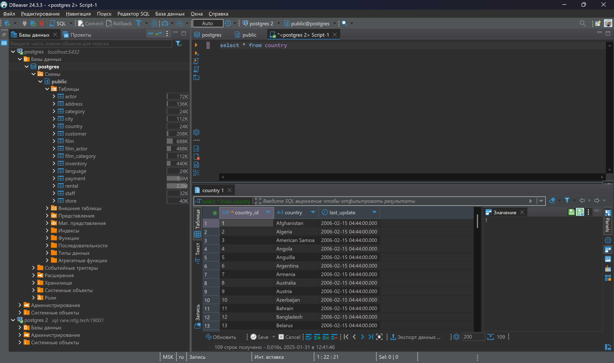
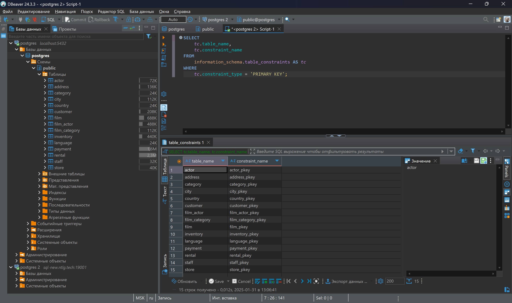

# Модуль 1. Домашнее задание по теме «Введение в SQL и установка ПО»
# Основная часть
## Задание 1.
Подключенная облачная база данных:

## Задание 2.
ER-диаграмма public:

## Задание 3.
Перечень таблиц и их первичных ключей:

| Название таблицы | Первичный ключ   |
|------------------|------------------|
| actor            | actor_id         |
| address          | address_id       |
| category         | category_id      |
| city             | city_id          |
| country          | country_id       |
| customer         | customer_id      |
| film             | film_id          |
| film_actor       | actor_id film_id |
| film_category    | film_id actor_id |
| inventory        | inventory_id     |
| language         | language_id      |
| payment          | payment_id       |
| rental           | rental_id        |
| staff            | staff_id         |
| store            | store_id         |
## Задание 4.
Результат выполнения запроса:

# Дополнительная часть
Результат выполнения запроса:

Ссылка на файл:

[Файл SQL-запроса]()
